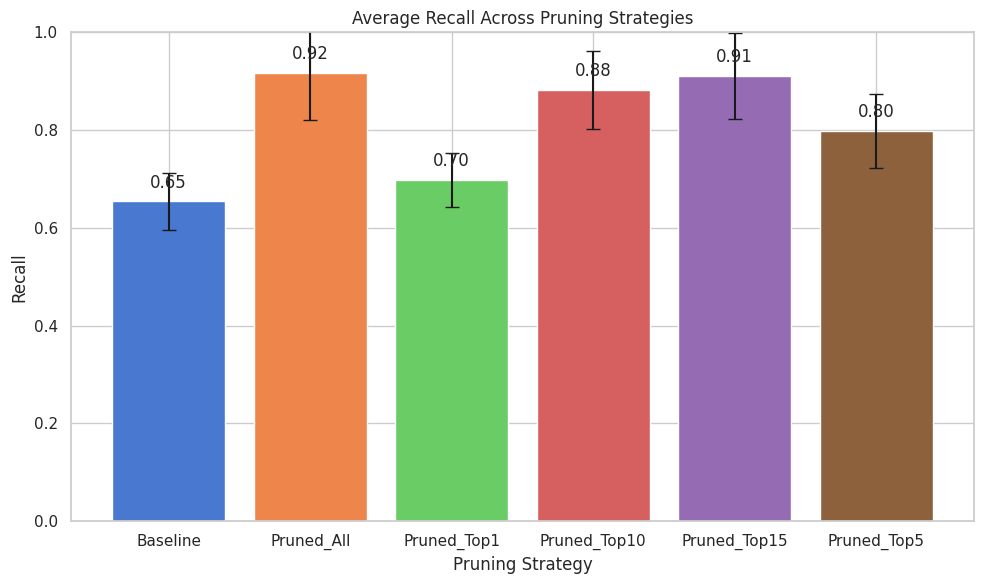

# Impact of Node Pruning on the Final Dense Layer of a CNN

This project investigates the use of node pruning within a stratified k-fold cross-validation framework to improve the recall of CNNs in medical imaging tasks.

## Key Features
- Implements node pruning to optimize model complexity and recall.
- Uses ResNet50V2 as the base model for binary classification of skin lesions.
- Evaluates performance metrics across multiple pruning strategies.

## Repository Structure
- `notebook/`: Contains the Colab notebook for experiments.
- `data/`: Includes relevant datasets used for training and evaluation.
- `figures/`: Visualization assets like bar plots and scatter plots.
- `README.md`: Project overview and usage instructions.

## Results Summary
Pruning strategies improved recall while maintaining AUC. Key metrics are summarized below:

| **Pruning Strategy** | **Accuracy Mean** | **AUC Mean** | **Precision Mean** | **Recall Mean** |
|----------------------|-------------------|--------------|--------------------|------------------|
| Baseline             | 0.7323            | 0.8131       | 0.7798             | 0.6540           |
| Pruned_All           | 0.6237            | 0.8028       | 0.5950             | 0.9167           |
| Pruned_Top1          | 0.7359            | 0.8119       | 0.7591             | 0.6978           |
| Pruned_Top5          | 0.7191            | 0.8113       | 0.6958             | 0.7987           |
| Pruned_Top10         | 0.6825            | 0.8107       | 0.6397             | 0.8821           |
| Pruned_Top15         | 0.6377            | 0.8061       | 0.6036             | 0.9101           |

## Data Acquisition
To reproduce the results, you’ll need to download the dataset from the [Kaggle ISIC 2024 Challenge](https://www.kaggle.com/competitions/isic-2024-challenge). Follow these steps:

1. **Install the Kaggle API:**
    ```bash
    pip install kaggle
    ```

2. **Obtain your Kaggle API key:**
    - Go to [Kaggle](https://www.kaggle.com/).
    - Navigate to your account settings.
    - Select "Create New API Token" to download the `kaggle.json` file.

3. **Place the `kaggle.json` file in the appropriate directory:**
    ```bash
    mkdir ~/.kaggle
    mv /path/to/kaggle.json ~/.kaggle/
    chmod 600 ~/.kaggle/kaggle.json
    ```

4. **Download the dataset using the Kaggle API:**
    ```bash
    kaggle competitions download -c isic-2024-challenge
    ```

5. **Extract the dataset:**
    ```bash
    unzip <downloaded-dataset>.zip -d data/
    ```

## How to Run
1. **Clone this repository:**
    ```bash
    git clone https://github.com/DevDizzle/node-pruning-research.git
    ```

2. **Install the required dependencies:**
    ```bash
    pip install -r requirements.txt
    ```

3. **Open the notebook:**
    - Navigate to `notebook/node-pruning-cnn-analysis.ipynb` and open it in Jupyter Notebook or [Google Colab](https://colab.research.google.com/).

4. **Reproduce the experiments:**
    - Follow the instructions within the notebook to run the experiments.

## Visualizations
The following visualizations are included in the repository:

- **Bar Plot:** Average recall across pruning strategies  
  

- **Box Plot:** Distribution of recall across strategies  
  

- **Scatter Plot:** Precision vs. Recall  
  

## Insights
- **Improved Recall:** Node pruning, especially the `Pruned_All` and `Pruned_Top10` strategies, significantly improved recall compared to the baseline.
- **Precision-Recall Trade-off:** The trade-off between precision and recall was effectively managed across pruning strategies.

## Citation
If you use this repository, please cite:

```bibtex
@misc{nodepruningresearch,
  author       = {DevDizzle},
  title        = {Impact of Node Pruning on the Final Dense Layer of a CNN},
  year         = {2024},
  howpublished = {\url{https://github.com/DevDizzle/node-pruning-research}}
}
